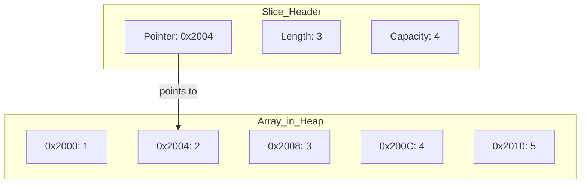

 %% Required for proper codeblock width %%
<style>

li,p {
	font-size: 32px;
}

code {
    font-size: 16px;
    line-height: normal;
}

/* left-align all content in Slides */
.reveal .slides {
    text-align: left;
}

</style>

%% Start of slides %%

# Devbook 
## Meeting 1

---

# Introduction

--

<grid drag="100 10" drop="0 0" align="left" >
 ### Goal
</grid>


<grid drag="100 85" drop="0 10" align="left" justify-content="center">
- A project based introduction to BE concepts
- Each project taking around 5 meetings
- Finished application at the end
</grid>

note: 
Some projects might require some knowledge or attending a previous project.


--

<grid drag="100 10" drop="0 0" align="left" >
 ### Meeting
</grid>

<grid drag="100 85" drop="0 10" align="left" justify-content="center">
Meetings will be split into:
- Discussing homework
- New theory
- Practical exercise & building on project
- Discussing next homework
</grid>

---

# Project

--

<grid drag="100 10" drop="0 0" align="left">
### Description
</grid>

<grid drag="100 85" drop="0 10" align="left" justify-content="center">
_**DevBook**_ is a simple app where developers can manage useful resources like articles, tutorials, tools, and libraries. 

Users can create resources with titles, URLs, descriptions, categories, and tags.
</grid>

--

<grid drag="100 10" drop="0 0" align="left">
### Steps
</grid>

<grid drag="100 85" drop="0 10" align="left" justify-content="center">
1. Basic functionality with Terminal UI
2. REST API
3. Permanent storage with PostgreSQL
4. Containerization with Docker
5. Testing, Documentation & Best practices
</grid>

---

# Go

--

<grid drag="100 10" drop="0 0" align="left" >
### What is Go?
</grid>

<grid drag="100 85" drop="0 10" align="left" justify-content="center">
- Compiled
- Expressive
- Statically typed
- Garbage-collected
</grid>

--


<grid drag="100 10" drop="0 0" align="left" >
### Why Go?
</grid>

<grid drag="100 85" drop="0 10" align="left" justify-content="center">
- Easy to learn
- Rich std library
</grid>

--

<grid drag="100 10" drop="0 0" align="left" >
### Syntax
</grid>

<grid drag="100 85" drop="0 10" align="left" justify-content="center">
```go []
package main

import (
	"fmt"
)

func name() string {
	return "World"
}

func main() {
	name := name()
	fmt.Printf("Hello %s!\n", name)
}
```
</grid>

--

<grid drag="100 10" drop="0 0" align="left" >
### Variables
</grid>

<grid drag="100 85" drop="0 10" align="left" justify-content="center">
```go []
var longVar int = 0
shortVar := 0

var (
	manyVars1 = 0
	manyVars2 = "hello"
)

const unchangeable = 0
```
</grid>

---
# Types

--

<grid drag="100 10" drop="0 0" align="left" >
### Base Types
</grid>

<grid drag="100 85" drop="0 10" align="left" justify-content="center">
```
bool

string

int  int8  int16  int32  int64
uint uint8 uint16 uint32 uint64 uintptr

byte // alias for uint8

rune // alias for int32
     // represents a Unicode code point

float32 float64

complex64 complex128
```
note: The `int`, `uint`, and `uintptr` types are usually 32 bits wide on 32-bit systems and 64 bits wide on 64-bit systems. When you need an integer value you should use `int` unless you have a specific reason to use a sized or unsigned integer type.

</grid>

--

<grid drag="100 10" drop="0 0" align="left" >
### Zero values
</grid>

<grid drag="100 85" drop="0 10" align="left" justify-content="center">
Uninitialized values are given initial zero value depending on type:
- **_0_** - for numeric types,
- **_false_** - for the boolean type
- **_""_** - (the empty string) for strings.
- **_nil_** - for pointers and pointer based types (slices, maps, interfaces)
</grid>

--

<grid drag="100 10" drop="0 0" align="left" >
### Pointers
</grid>

<grid drag="100 85" drop="0 10" align="left" justify-content="center">
Pointers hold the memory address.
```go []
// Declare a variable
a := 1

// Declare a pointer
ptr := &a

// Change the value
*ptr = 2

fmt.Println(a) // Will print "2"
```
</grid>

--

<grid drag="100 10" drop="0 0" align="left" >
### Errors
</grid>

<grid drag="100 85" drop="0 10" align="left" justify-content="center">
Errors are first class types in Go
```go []
// Declare a variable
var err error

// Can be passed to and returned by functions
func errHandler(err error) error {
	return err
}


```
</grid>

--

<grid drag="100 10" drop="0 0" align="left" >
### Error chaining
</grid>

<grid drag="100 85" drop="0 10" align="left" justify-content="center">
Errors can be chained and joined.
```go []
var (  
    err1    = errors.New("someError")  
    err2    = errors.New("someError")  
    errWrap = fmt.Errorf("%s:%w", "module", err1)  
)

// What are the messages of err1, err2, errWrap ?

// True of False?
err1 == err2, 
errors.Is(err1, err2),
err1.Error() == err2.Error(),

err1 == errWrap,
errors.Is(errWrap, err1),
err1.Error() == errWrap.Error()

errors.Is(errWrap, err1)
errors.Is(err1, errWrap))
```
</grid>

note:
false, false, false
false,true,false
true, false

--

<grid drag="100 10" drop="0 0" align="left" >
### Structs
</grid>

<grid drag="100 85" drop="0 10" align="left" justify-content="center">
Structures are a collection of fields.
```go []
type Point struct {
	X int
	Y int
}

v1 := Point{}
v2 := Point{1,2}
//v2 := Point{1} -- invalid, should 1 go to X or Y?
v3 := Point{X: 5}
```
</grid>

--

<grid drag="100 10" drop="0 0" align="left" >
### Arrays
</grid>
	
<grid drag="100 85" drop="0 10" align="left" justify-content="center">
The type **[n]T** is an array of **n** values of type **T**.
```go []
arr1 := [3]int{}				// [3]int{0,0,0}
arr2 := [3]int{1,2,3}		// [3]int{1,2,3}
arr3 := [4]int{1,2,3}		// [4]int{1,2,3,0}
//arr4 := [2]int{1,2,3}	// error - too many values
```
An array's length is part of its type, so arrays cannot be resized.
</grid>

--

<grid drag="100 10" drop="0 0" align="left" >
### Slices
</grid>

<grid drag="100 40" drop="0 10" align="left" justify-content="center">
A slice is a dynamically-sized, flexible view into the elements of an array. 

In simplified terms, it is a pointer to an array with length and capacity.
</grid>

<grid drag="100 50" drop="0 40" align="left" justify-content="center">

```go []
// create a new array of size 5 and return slice on it
slice := make([]int, 5) 

// slice is a reference to underlying array
numbers := [6]int{0,1,2,3,4,5}

var s []int = numbers[1:4] // []int{1,2,3}
s[0] = 9
s[1] = 8

fmt.Println(numbers)
// 0, 9, 8, 3, 4, 5
``` 
<!-- element class="fragment fade-in-then-out" data-fragment-index="1" -->
</grid> 

<grid drag="100 50" drop="0 40" align="left" justify-content="center">
<!-- element class="fragment fade-in-then-outout" data-fragment-index="2" -->


</grid> 

--

<grid drag="100 10" drop="0 0" align="left" >
### Slices 2
</grid>

<grid drag="100 85" drop="0 15" align="left" justify-content="center">
Slice can be extended to add new values.
```go []
// define a slice of size 3 and cap 5 and add 2 values
slice := make([]int, 3, 5)  
slice = append(slice, 1)
slice = append(slice, 2)

// This append will go beyond capacity 
// and will cause reallocation and copy
slice = append(slice, 3)
```

When building slices we can skip the bounds

```go []
var a [10]int

// For `a` these will be equivalent
a[0:10]
a[:10]
a[0:]
a[:]
```

</grid>

--

<grid drag="100 10" drop="0 0" align="left" >
### Maps
</grid>

<grid drag="100 85" drop="0 10" align="left" justify-content="center">
A map maps keys to values. 

```go []
// Initialize 2 maps
m := make(map[int]string)
m2 := map[int]string{}

// Add value
m[1] = "Hello"

// get values
v := m[1]

// checking if value exists
v, ok := m[2] // Will return 0, false

// deleting key
delete(m, 1)
```
</grid>

---

# Flow control

--

<grid drag="100 10" drop="0 0" align="left" >
### If / else
</grid>

<grid drag="100 85" drop="0 10" align="left" justify-content="center">
- Parentheses are optional
- Brackets are required

```go []
if b {
	fmt.Println("True")
} else {
	fmt.Println("False")
}

// We can also use if with "short statement". Following two checks are equivalent
var m map[int]string
_, ok := m[0]
if ok {
	// Do something
}

if v, ok := m[0]; ok {
	// Do something
}
```
</grid>

--

<grid drag="100 10" drop="0 0" align="left" >
### Loops
</grid>

<grid drag="100 85" drop="0 10" align="left" justify-content="center">
- Only one type of loops - **for**

```go []
// Long form - "init; condition; post"
for i := 0; i < 10; i++ {
	fmt.Println(i)
}

// Short form - "condition"
for i < 10 {
	fmt.Println(i)
}

// Forever
for {}
```
</grid>

--

<grid drag="100 10" drop="0 0" align="left" >
### Loops 2
</grid>

<grid drag="100 85" drop="0 10" align="left" justify-content="center">
- We can also iterate through arrays, slices and maps

```go []
arr  := [1]byte{'a'}
m := map[string]string {
	"key1": "value1",
}

for idx, val := range arr {
	fmt.Println(idx, val) // Will print "0 a"
}
for key, val := range map {
	fmt.Println(key, val) // Will print "key1 value1"
}

// Short form - only indexes, keys
for idx := range arr {}
for key := range m {}
```
</grid>

--

<grid drag="100 10" drop="0 0" align="left" >
### Switch
</grid>

<grid drag="100 85" drop="0 10" align="left" justify-content="center">
- No default fallthrough - will only execute selected case
- Switch cases can be any value or expression

```go []
var name string
switch name {
	case "John":
		// Do something
	case "Jane":
	case "TestUser":
		fallthrough
	default:
		// Handle default
}

today := time.Now().Weekday()
switch time.Saturday {
	case today + 0:
		fmt.Println("Today.")
	case today + 1:
		fmt.Println("Tomorrow.")
	default:
		fmt.Println("Too far away.")
	}
}
```
</grid>

--

<grid drag="100 10" drop="0 0" align="left" >
### Switch 2
</grid>

<grid drag="100 85" drop="0 10" align="left" justify-content="center">
Switch does not need condition

```go []
t := time.Now()
switch {
case t.Hour() < 12:
	fmt.Println("Good morning!")
case t.Hour() < 17:
	fmt.Println("Good afternoon.")
default:
	fmt.Println("Good evening.")
}
```
</grid>

--

<grid drag="100 10" drop="0 0" align="left" >
### Functions
</grid>

<grid drag="100 85" drop="0 10" align="left" justify-content="center">

```go []
func name(arg1 string, arg2 int64) int64 {
	return 0
}

func joinTypes(str1, str2 string) int64

func multipleReturns() (int64, error)

func noReturns() {}

func ignoredArg(_ int64) {}
```

Functions can have named returns

```go[]
func named() (i int64, err error) {
	if true {
		return 1, nil
	}
	return // If no values are provided it will return current states of i, err
}

```


</grid>

--

<grid drag="100 10" drop="0 0" align="left" >
### Move semantics
</grid>

<grid drag="100 85" drop="0 10" align="left" justify-content="center">
We have 2 ways of passing data to a function: 
- by value
- by reference

```go []
func byValue(a int) {}
func byRef(a *int) {}

v := 0

byValue(a) // Will copy value to function argument
byRef(&a) // Will pass a pointer to value

```
Can make a big impact when passing large structures

note:
Things passed by reference always:
- arrays - (pointer, length)
- slices - (pointer, length, capacity)
- maps - (pointer)
- strings - (pointer, length)
</grid>

--

<grid drag="100 10" drop="0 0" align="left" >
### Struct methods
</grid>

<grid drag="100 85" drop="0 10" align="left" justify-content="center">
You can add methods to any type you have declared.

```go []
type MyType struct {}

// Receiver (m) is passed by copy 
// you will not be able to modify the structure
func (m MyType) MyMethod() {}

// Receiver is passed by reference
func (m *MyType) MySecondMethod() {}

// You can also alias existing types to add your own methods
type myInt int

func (m myInt) IsNegative() bool { return m < 0 }
```
</grid>

--

<grid drag="100 10" drop="0 0" align="left" >
### Interfaces
</grid>

<grid drag="100 85" drop="0 10" align="left" justify-content="center">
Go has **_implicit_** interfaces. It means that you don't have to state that a struct implements
an interface. It is checked automatically based on implemented methods.

```go []
type Reader interface {
	Read(p []byte) (n int, err error)
}

type File struct {}

func (f *File) Read(p []byte) (int, error) {
	// Read from file and put data in `p`
}

func ReadAll(r Reader) (data []byte, err error) {
	_, err = r.Read(data)
	return data, err
}
```
</grid>

--

<grid drag="100 10" drop="0 0" align="left" >
### Defer
</grid>

<grid drag="100 85" drop="0 10" align="left" justify-content="center">
- Will be called after function returns
- Function calls are pushed onto a stack (LIFO order)

```go []
defer fmt.Println("!")
defer fmt.Print("world")

fmt.Print("Hello ")

// Will print "Hello world!"
```
</grid>

---

# Code structure

--

<grid drag="100 10" drop="0 0" align="left" >
### Packages
</grid>

<grid drag="100 85" drop="0 10" align="left" justify-content="center">
- All source files in the same folder must have the same package
- File with **_main_** function must belong to package **_main_**
- They can be included using **_import_** directive

```go []
package main

import (
	"fmt"
)

func main() {
	fmt.Println("Hello")
}
```
</grid>

--

<grid drag="100 10" drop="0 0" align="left" >
### Public vs Private
</grid>

<grid drag="100 85" drop="0 10" align="left" justify-content="center">
All files within the same package have access to all information within the package.

For other packages you can only access **_exported_** values.

Values starting with uppercase letter are exported.

```go []
const packetTTL = time.Second * 3600 // private value
const PacketTTL = time.Second * 3600 // public value
```

The same goes for functions and types.
</grid>

---

# Tooling

--

<grid drag="100 10" drop="0 0" align="left" >
### Go tooling
</grid>

<grid drag="100 85" drop="0 10" align="left" justify-content="center">
- Go provides many tools through the **_go_** command

```bash
go build   # building executables
go run     # build and run 
go test    # run tests / benchmarks
go mod     # manage modules
go get     # download a package
go fmt     # format go code
go help    # find out more about a command
```
</grid>

--

<grid drag="100 10" drop="0 0" align="left" >
### Important for us
</grid>

<grid drag="100 85" drop="0 10" align="left" justify-content="center">
```bash
# Initialize new module
go mod init {name}

# Run code in current folder (must contain main package with main function)
go run .

# Test code
go test       # run all tests in current folder
go test ./... # run all tests in current folder and subfolders

# Formatting
go fmt # format current folder

```
</grid>


---
# Exercises

--

<grid drag="100 10" drop="0 0" align="left" >
### Exercise 1
</grid>

<grid drag="100 85" drop="0 10" align="left" justify-content="center">
Write a function called **_Fibonacci_** accepting an **_int_** and returning n-th fibonacci number.

```go []
// Sample calls
Fibonacci(0) // returns 0
Fibonacci(1) // returns 1
Fibonacci(2) // returns 1
Fibonacci(3) // returns 2
```

Check if your code passes tests.
</grid>

--

<grid drag="100 10" drop="0 0" align="left" >
### Exercise 2
</grid>

<grid drag="100 85" drop="0 10" align="left" justify-content="center">
Write a function called **_AtoI_** accepting a **_string_** representation of a number and returning an **_int_**

You can assume that the passed value will be correct.

```go []
// Sample calls
AtoI("0") // returns 0
AtoI("123") // returns 123
AtoI("-432") // returns -432
```

Check if your code passes tests.
</grid>

--

<grid drag="100 10" drop="0 0" align="left" >
### Exercise 3
</grid>

<grid drag="100 85" drop="0 10" align="left" justify-content="center">
Write a function called **_ArrStats_** accepting an **_[]int_** and returning 3 values:
- min
- max
- average

```go []
// Sample calls
ArrStats([]int{0,1,2,3,4}) // returns (0, 4, 2.5)
ArrStats([]int{}) // returns (0, 0, 0)
```

Check if your code passes tests.
</grid>


--

<grid drag="100 10" drop="0 0" align="left" >
### Exercise 4
</grid>


<grid drag="100 85" drop="0 10" align="left" justify-content="center">
Write a function called **_MergeMap_** accepting 2 **map[string]string** and returning one with keys from both. Keys from first map takes precedence.

```go []
// Sample calls
MergeMap(
	map[string]string{"k1": "v1"},
	map[string]string{"k2": "v2"},
) // returns map[string]string{"k1":"v1", "k2":"v2"}

MergeMap(
	map[string]string{"k1": "v1", "k2":"v2a"},
	map[string]string{"k2": "v2b", "k3":"v3"},
) // returns map[string]string{"k1":"v1", "k2":"v2a", "k3":"v3"}
```

Check if your code passes tests.
</grid>

---

# Back to Devbook

--

<grid drag="100 10" drop="0 0" align="left" >
### Plan for today
</grid>

<grid drag="100 85" drop="0 10" align="left" justify-content="center">
We want to have a simple TUI app allowing us to:

1. Store items in memory
2. Operate on items:
	1. Add
	2. Remove
	3. List
3. Basic terminal based UI
</grid>

--

<grid drag="100 10" drop="0 0" align="left" >
### Preparations
</grid>

<grid drag="100 85" drop="0 10" align="left" justify-content="center">
Create a folder for the project 

```
mkdir devbook
cd devbook
go mod init devbook
```

It will create a **_go.mod_** file describing our module

```
module devbook

go 1.25.3
```
</grid>

--

<grid drag="100 10" drop="0 0" align="left" >
### Main file
</grid>

<grid drag="100 85" drop="0 10" align="left" justify-content="center">
```go [|1-2|4-9|11-14]
// Declare main package
package main

// Import IO related libraries
import (
	"fmt"   // Formatted I/O
	"bufio" // Buffered I/O - useful for user input
	"os"    // OS specific Stdin and Stdout
)

// Program entrypoint
func main() {
	fmt.Println("Hello World!")
}
```
</grid>

--

<grid drag="100 10" drop="0 0" align="left" >
### Item structure and store
</grid>

<grid drag="100 85" drop="0 10" align="left" justify-content="center">
```go [|1-7|9-21]
// Item definition
type Item struct {  
    Name        string  
    Description string  
  
    URL string  
}  

// Simple in-mem store with starting items
var store = map[string]Item{  
    "item1": {  
       Name:        "item1",  
       Description: "search engine",  
       URL:         "https://google.pl",  
    },  
    "item2": {  
       Name:        "item2",  
       Description: "other search engine",  
       URL:         "https://bing.com",  
    },  
}
```
</grid>

--

<grid drag="100 10" drop="0 0" align="left" >
### Listing and printing items
</grid>

<grid drag="100 85" drop="0 10" align="left" justify-content="center">
```go [|1-6|8-12]
func ListItems() []Item {
	arr := make([]Item, 0, len(store))
	for _, item := range store {
		arr = append(arr, item)
	}
}

func PrintItems(items []Item) {
	for _, item := range items {
		fmt.Printf("%s : %s : %s\n", item.Name, item.URL, item.Description)
	}
}
```
</grid>

--

<grid drag="100 10" drop="0 0" align="left" >
### Handling User input
</grid>

<grid drag="100 85" drop="0 10" align="left" justify-content="center">
```go [|1|3-11|13-21]
const prompt = "> "

func readLine() (string, error) {  
    scanner := bufio.NewScanner(os.Stdin)  
    scanner.Scan()  
    if err := scanner.Err(); err != nil {  
       return "", err  
    }  
  
    return scanner.Text(), scanner.Err()  
}

func AskForString(question string) (string, error) {  
    _, err := fmt.Printf("%s\n%s", question, prompt)  
    if err != nil {  
       return "", err  
    }  
  
    answer, _ := readLine()  
    return strings.TrimSpace(answer), nil  
}
```
</grid>

--

<grid drag="100 10" drop="0 0" align="left" >
### Asking for a choice
</grid>

<grid drag="100 85" drop="0 10" align="left" justify-content="center">
```go []
func AskForMapChoice(question string, choices map[string]string) (string, error) {  
    // Print question  
    _, err := fmt.Println(question)  
    if err != nil {  
       return "", err  
    }  
  
    // Check for longest key for formatting  
    maxLength := 0  
    for key := range choices {  
       if len(key) > maxLength {  
          maxLength = len(key)  
       }  
    }  
  
    // Sort by key  
    type choiceStruct struct {  
       key   string  
       value string  
    }
      
    sortedChoices := make([]choiceStruct, 0, len(choices))  
    for k, v := range choices {  
       sortedChoices = append(sortedChoices, choiceStruct{key: k, value: v})  
    }  
    sort.Slice(sortedChoices, func(i, j int) bool { return sortedChoices[i].key < sortedChoices[j].key })  
  
    // Print choices  
    for _, choice := range sortedChoices {  
       fmt.Printf("%*s: %s\n", maxLength, choice.key, choice.value)
    }  
  
    // Print prompt  
    fmt.Print(prompt)
  
    // Read answer  
    answer, err := c.readLine()  
    if err != nil {  
       return "", err  
    }  
  
    // Validate  
    if _, ok := choices[answer]; !ok {  
       fmt.Println("Invalid choice")  
       return c.AskForMapChoice(question, choices)  
    }  
  
    return answer, nil  
}
```
</grid>

--

<grid drag="100 10" drop="0 0" align="left" >
### Menu "view"
</grid>

<grid drag="100 85" drop="0 10" align="left" justify-content="center">
```go [|2-8|11-14|16-34]
func menuView(cli *input.CLI) error {  
    choice := map[string]string{  
       "a": "Add",  
       "e": "Edit", 
       "d": "Delete",  
       "l": "List",  
       "q": "Exit",  
    }  
  
    for {
       choice, err := AskForMapChoice("Choose option", choices)  
       if err != nil {  
          return err  
       }  
  
       switch choice {  
       case "a":  
          if err = addItemView(cli); err != nil {  
             return err  
          }  
       case "e":  
          fmt.Println("Not yet implemented")  
       case "d":  
          if err = deleteItemView(cli); err != nil {  
             return err  
          }  
       case "l":  
          printItems(ListItems())  
       case "q":  
          return nil  
	  default:
		  fmt.Println("Invalid choice")
       }  
       fmt.Println()  
    }  
}
```
</grid>

--

<grid drag="100 10" drop="0 0" align="left" >
### Add / Remove / List "views"
</grid>

<grid drag="100 85" drop="0 10" align="left" justify-content="center">
```go [|1-17|19-30|32-35]
func addItemView(cli *input.CLI) error {  
    name, err := cli.AskForString("Name")  
    if err != nil {return err}  
  
    description, err := cli.AskForString("Description")  
    if err != nil {return err}  
  
    url, err := cli.AskForString("URL")  
    if err != nil {return err}  
  
    store[name] = Item{
	    Name:        name,  
		Description: description,  
		URL:         url,
	}
    return nil  
}  

func deleteItemView(cli *input.CLI) error {  
    name, err := cli.AskForString("Name")  
    if err != nil {return err}  
  
    if _, ok := store[name]; !ok {  
       fmt.Println("Item does not exist")  
       return nil
    }  
  
    delete(store, name)  
    return nil  
}

func printItems() {  
    for _, item := range store {  
       fmt.Printf("%s : %s : %s\n", item.Name, item.URL, item.Description)  
    }  
}  
```
</grid>

---

# Refactor

--

<grid drag="100 10" drop="0 0" align="left" >
### Issues
</grid>

<grid drag="100 85" drop="0 10" align="left" justify-content="center">
- Global store variable 
- Mixing responsibilities in one file
	- Logic
	- User input
	- Storage
- Not ready for future expansion
</grid>

--

<grid drag="100 10" drop="0 0" align="left" >
### Folder structure
</grid>

<grid drag="100 85" drop="0 10" align="left" justify-content="center">
Basic project structure :
```
devbook
|- cmd         - for our main file
|  |- main.go
|-pkg          - place for our packages
|  |- devbook   - our models
|  |  |- store.go
|  |  |- item.go
|  |- tui       - handling user interface & interaction
|  |  |- input.go
|  |  |- views.go
```
</grid>

---

# Homework

--

<grid drag="100 10" drop="0 0" align="left" >
### Assignments
</grid>

<grid drag="100 85" drop="0 10" align="left" justify-content="center">
- Add editing
- Complete all exercises
- Take a look at:
	- [Tour of Go](https://go.dev/tour/welcome/1) - great introduction to Go
</grid>

---